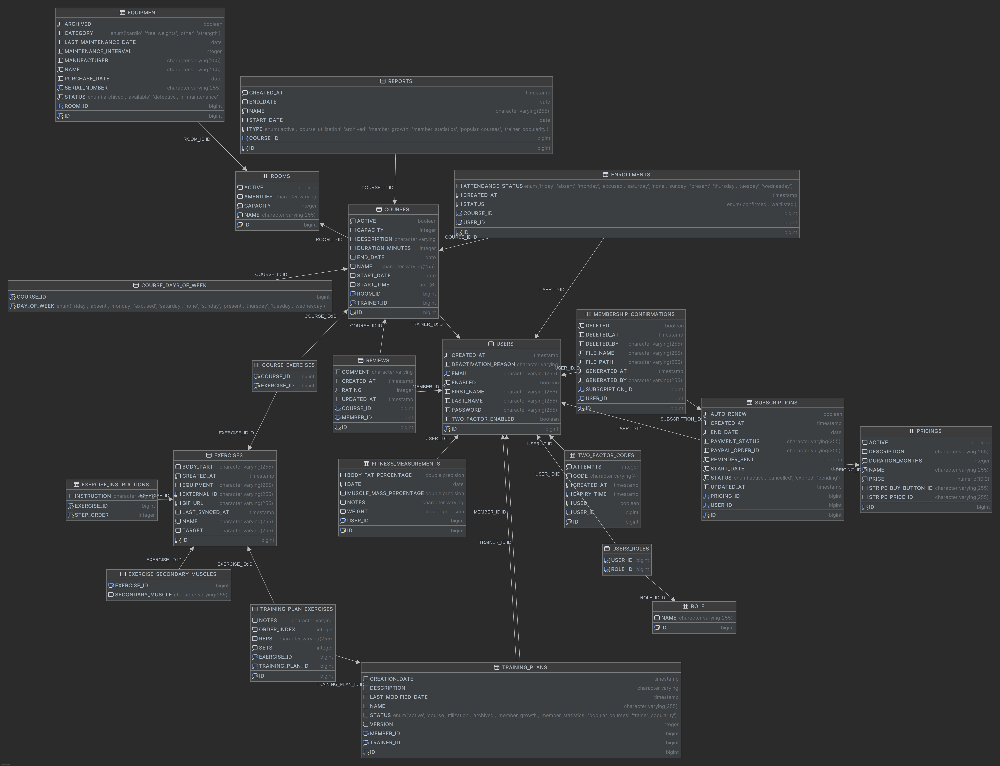

# Muskel Management

Web application for managing a gym: memberships, courses, trainers, rooms and equipment.
Team project (3 people) at OTH Regensburg.



## Features

- **Roles:** member, trainer, admin – with Spring Security and two-factor authentication
- **Memberships & payment:** subscription plans, checkout via Stripe / PayPal (sandbox), PDF confirmations, e-mail reminders
- **Courses:** booking, trainer course management, rooms and equipment administration
- **Exercises:** exercise library via the ExerciseDB API
- **REST API + server-side UI** (Thymeleaf, Tailwind CSS)

## Tech

Java 21 · Spring Boot 3 (Web, Security, Data JPA, Mail) · Thymeleaf · Tailwind CSS · H2 · Stripe · Docker

## Run

```bash
./gradlew bootRun          # http://localhost:8080
# or
docker compose up --build
```

API keys (Stripe, PayPal, mail, ExerciseDB) are configured in `src/main/resources/application.properties`.
